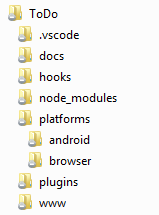
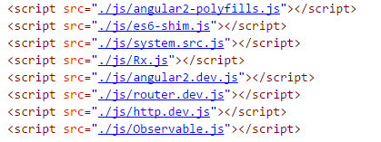
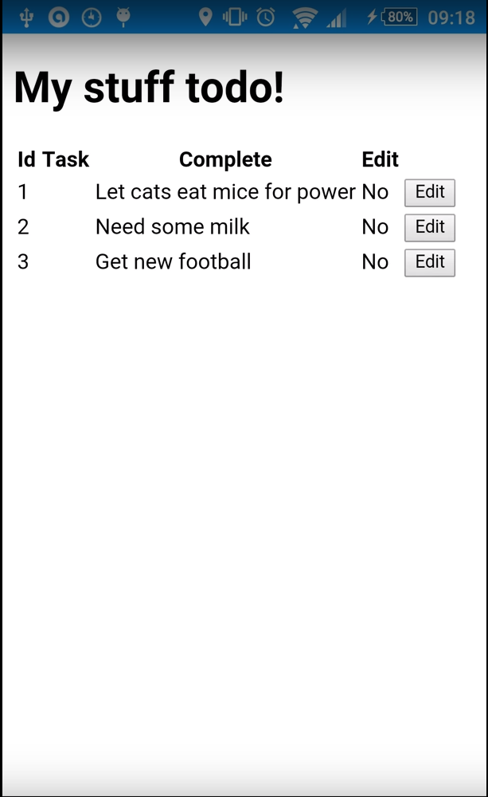

# Introduction

My findings of working with **Cordova** though the command-line.

I've structured this as a story of events rather than _prettifying_ so we can get an insight into issues, and more importantly have a record of them should we use it in the future.

TL;DR:
I _suspect_ **Ionic** is better experience.

## [Supported Platforms](http://cordova.apache.org/docs/en/latest/guide/platforms/index.html)
- Amazon Fire OS
- Android
- Blackberry 10
- Browser
- Firefox OS
- IOS (aka Apple)
- Windows
- Windows 8
- Ubuntu

# Setup

Derived from: http://cordova.apache.org/

_// install Cordova globally_ 
**npm install -g cordova**		

>[I had an issue with npm not being in the path so when I typed **cordova** it wasn't found](https://cordova.apache.org/docs/en/latest/guide/cli/index.html)

	
_// create a scaffold app, this is basically the folder structure that Cordava expects  
_// ... (prob best to live with it rather than fight it)_ 
**cordova create MyApp**

_// Ensure you include both **android** and **browser** as a platform_ 
_// ... (Perform the install inside **MyApp**_) 
**cordova platform add &lt;platform name&gt;**

You can get help on any command be using (for example) **cordova help build** for additional options 

# Build & Deploy

<table>
	<tr><td>Command</td><td>Outcome</td></tr>
	<tr>
		<td><strong>cordova build</strong></td>
		<td>Builds <strong>all</strong> defined platforms</td>
	</tr>
	<tr>
		<td><strong>cordova run android --emulator</strong></td>
		<td>
			Runs project on emulator 
			<strong><i>Running on device is much, much quicker and less hassle!</i></strong>
		</td>
	</tr>
	<tr>
		<td><strong>cordova run android --device</strong></td>
		<td>Runs on device connected to a USB cable</td>
	</tr>
	<tr>
		<td></td>
		<td></td>
	</tr>
</table>

> I didn't always find it as straight-forward as the above, 
> so I've added a couple of batch files, **run-browser.cmd** and **run-android.cmd** in the 
> repository (does a clean, compiles the ES6 code, then runs the app)
>
> _That said I don't think we need these now (see later for info on **hooks**)_

# Development Paths

1. Cross Platform (CLI) workflow - support as as many platforms as you like
2. Platform-centred workflow - focus on a particular platform, assumes low-level interaction.

> I see us as being **(1)** and where I've been focussing.	 

_NB: You can go from approach **(1)** to approach **(2)**, but not the other way around._

# Android Dependencies

- [Java Development Kit (JDK) (7 or later)](http://www.oracle.com/technetwork/java/javase/downloads/jdk7-downloads-1880260.html) 
	_(When installing on Windows you also need to set JAVA_HOME Environment Variable according to JDK installation path (for example, C:\Program Files\Java\jdk1.7.0_75))_  

- [Android stand-alone SDK tools](http://developer.android.com/sdk/installing/index.html?pkg=tools) 
	_(You also need to update your path, [see here for details](http://cordova.apache.org/docs/en/latest/guide/platforms/android/index.html#install-the-android-sdk))_ 
	_(You can also install [Android studio](http://developer.android.com/sdk/installing/index.html?pkg=studio))_ 

- [Install Android emulator](http://cordova.apache.org/docs/en/latest/guide/platforms/android/index.html#install-the-android-sdk#configure-an-emulator)

> I endup re-installing using [an egghead video](https://egghead.io/lessons/angularjs-install-android-sdk-for-ionic) as I was having 
> issues, however I'm not convinced it was related: 

# Behind the scenes

The Cordova folder structure looks like this:

Your HTML/CSS/JS code lives in the **www** folders and is then build into the **platforms** sub-directory.

#	Running up ...

_// Run up cordova as a static website_	  
**cordova run browser --verbose**
> **--verbose** isn't _required_, however I've found it useful to know _what's going on_ during the build.
> Also I don't think you _need_ to have **browser** as an additional platform, can probably just run straight from **www**, but this
> felt cleaner - I guess you could use **www** for dev and then publish to **platform/browser** for release builds.

_// Run up on an Android device (connected over USB)_	  
**cordova run android --device --verbose**

# Getting it working

## Issues
Ideally our **node_modules** would sit within the **www** folder.  

When building into **platforms** the **node_modules** would be copied along too.

However I found this wouldn't work.  It just hung at the **before_prepare** step. Indeed I lost several hours looking into this without much progress (started installing VS 2015 in the end).

> I've since come to the conclusion that it was working all along, it was the amount of time it was taking to copy 
> over the **node_modules** folder into **platforms** made me _think_ it had hung.  
> Not confirmed, didn't want to waste time finding out!

## Fixes
In the end I had to compromise and only include the dependecies I required rather than the full **node_modules** hierarchy:

Naturally this is far from ideal :-(

I suspect **Ionic** handles all this better as they've done a lot of work with ag2 and npm to have it working out of the box.  Another +1 for the ionic column? 

## TypeScript compilation

Finally I added a custom **hook** that compiles the **TypeScript** files into JavaScript before publishing to the **platforms** folder.
> This replaces the batch files I spoke of previously.

Again there may be better ways of doing this, but I just want to establish that all this works _in principal_.

# Demo
Added video of it working on my device, can be seen in-situ

This is a pure port of the web version we used as a template.  I'm just gathering the _Cordova_ story at this point.

# VS Code Extension

There is a [Cordova VS Code plug-in](https://marketplace.visualstudio.com/items?itemName=vsmobile.cordova-tools) which I had a quick go with.

Managed to attach the debugger to the app running on the device, quite straightforward exercise.

# Summary

- Wasn't a walk in the park to get working, but once you _get_ what's happening it's not too bad.
- We'd need to find a way around JavaScript include hack I've adopted as this won't scale well.
  _This could be a simple matter of installing the dependencies differently ... I'm just using **devDependencies** at the moment_.
- **Cordova** plug-in works well, debugging onto the device was simple and straight-forward.

# Reccomendation

My thinking before starting this was if we didn't need the styling and animations of **Ionic** or anything else it offers it would 
make sense to use **Cordova**.

Now my gut is telling me we _still_ may be best off using **Ionic** as I think (based on very little knowledge of **Ionic**!) 
it's more geared for the Angular world (e.g. I suspect the **node_modules** issue is sorted in their templates?).

Still a better than using **NativeScript** but then that's offering something else completely.  

However once I look at **Ionic** my opinion may change again.
