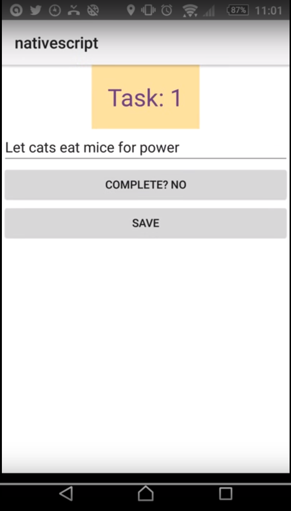

# TL;DR
Should we use NativeScript to provide in-store applications?
 **No**

# Supports
- IOS (you need a MAC)
- Android
- Windows Phone (in 2016)

# Requirements

- Node.js (v5 and above)

## Android Dependencies

- (Android) JDK 7 or later
- Apache Ant (for builds)
- Android SDK
- Emulator software (provided as part of the SDK)

## Apple Dependencies

- You need a MAC :-(
- And other stuff	 

# Developer Experience

*Painful*, however I think this is less to do with NativeScript and more to do with developing _Native apps_.

- Couldn't get the emulator working - given this isn't a _deep dive_ I used a real device instead
- 12 secs for a build, 2 mins to deploy to device (or start debugger)

The debugger works OK, it's works like the Chrome web browser debugger.  
But this is also painful.  Make a change, run up, wait 2 minutes, make a change, wait two minutes ... 

The Angular2 front-end lives *on top* of NativeScript.  In my mind it's a bit like React whereby you have *JSX* compiling down to JavaScript calls.

NS has it's own JavaScript API/language.  The Angular2 front-end sits above this and is converted into the underlying JavaScript API.

This isn't necessarily an issue, but it does make it a challenge in the documentation, as most examples show the JavaScript and not the Angular2 version (aka JSX).

## Running and Debugging

Fairly simple once you've got the dependencies installed.

- **tns run android**
- **tns debug android** 

## NativeScript status

Immature - the version I've been using doesn't even have 2-way data binding.  To be fair it was added [recently](https://github.com/NativeScript/nativescript-angular/issues/27), but at time of writing my demo still doesn't work!

# Demo

Speaking of which, here's my demo :-)

# The good, the bad and the Chris :-)

## Pros
- Results are native and therefore speedy
- TypeScript supported
- If it matures well, it's better solution for us than *proper* *Native* in **Java** and **Swift/Objective C**
- (witnessed, not tried) You can fork between Android and IOS by filename and *dip* into native apis.

## Cons
- Proprietary language (akin to XAML)
- CSS support is a setset
- Immature - version I have doesn't even have 2-way data binding (though this has been added yesterday)
- Documentation is for NativeScript, not the NativeScript/Angular2 combo, lots of blind alleys ...
- The Angular2 version feels like a bolt on added afterwards.   
- Change/development turnaround is painful and infuriating
- Couldn't get emulator working (granted, didn't spend lots of time on it)
- New skillset for the team to learn, I imagine this will take more than a couple of days in a workshop!

# Recommendation

If we absolutely, positively _**have**_ to go Native* then I'd recommend looking again at options, including NativeScript.

If using a **WebView** is an available option, then back away from NativeScript+.

Whilst the nirvana NativeScript describes is one controller, multiple templates I think they're a long way off that currently.

* And by Native I mean _something_ going down into actual Java and Swift/Objective-C languages.

+ That's not to suggest that NativeScript is bad, I think it has possibilities, but the downsides are too numerous when compared with a WebView solution.
  
	
# Going further

If we decide to go futher, I've got more [random notes](thoughts.md) to get us setup and working.

